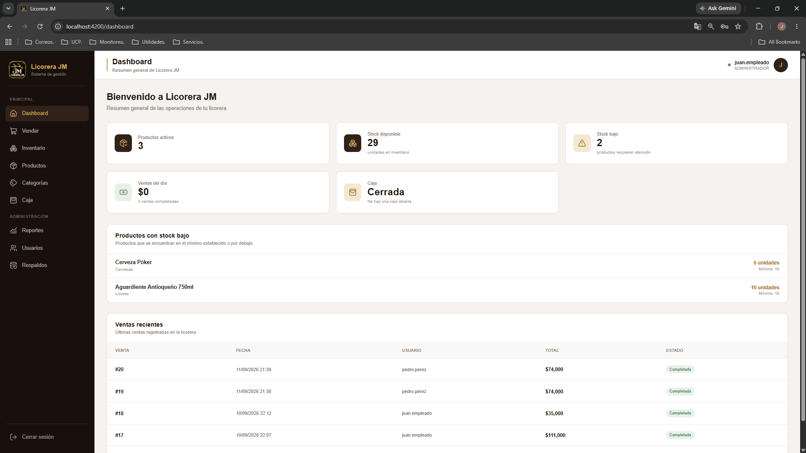
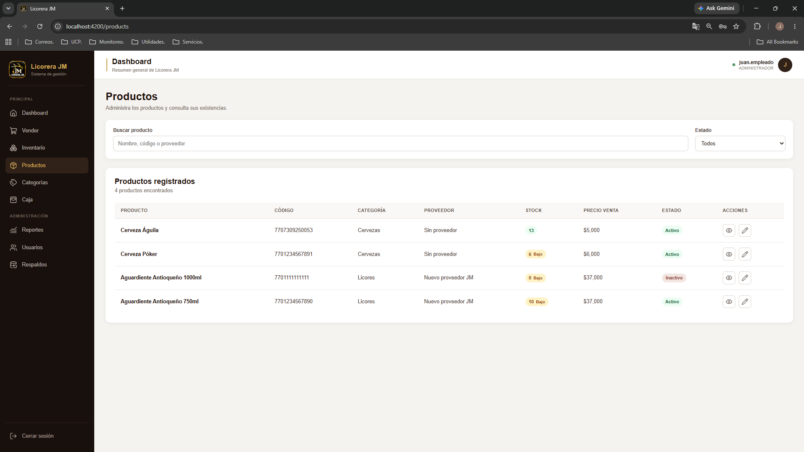
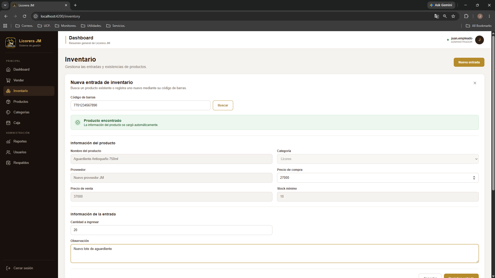
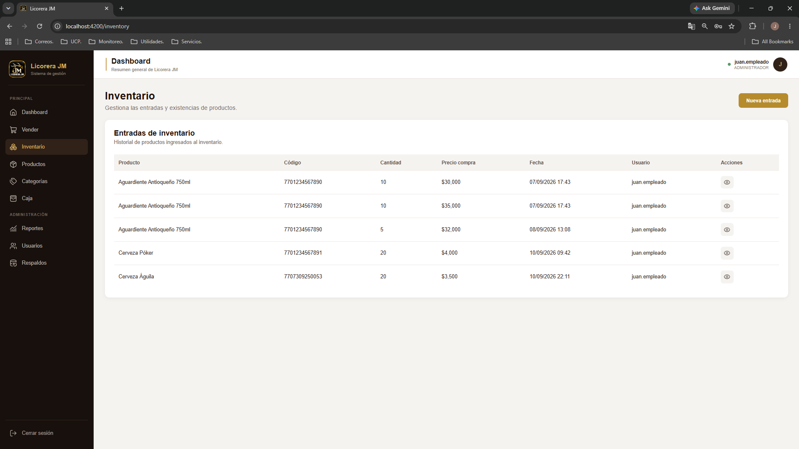

# Licorera JM

## Full-Stack Inventory & Sales Management System

Licorera JM is a full-stack business management system designed for a local liquor store.

The application manages the main operational processes of the business, including inventory, barcode-based product management, sales, cash register operations, users and roles, reports, database backups and restoration.

The project was designed and developed as a complete end-to-end software solution, covering database design, REST API development, frontend implementation, authentication and authorization, business rules, and Windows deployment.

---

## 📌 Project Status

**Status: Stable / Completed**

The application has been tested end-to-end, including installation and execution on a separate Windows machine using the standalone installer.

---

## 🚀 Features

### 📦 Inventory Management

- Product registration and management.
- Product categorization.
- Stock control.
- Inventory entries.
- Supplier information.
- Purchase and sale price management.
- Minimum stock configuration.
- Low-stock management.
- Inventory tracking using FIFO lots.
- Product identification through barcodes.

### 🔎 Barcode Scanner Integration

The system supports the use of a physical barcode scanner for product identification.

Products can be registered and managed using a barcode scanner, allowing the system to quickly identify products during inventory operations and sales.

The scanner works as an input device that sends the barcode directly to the application.

```text
Barcode Scanner
       ↓
    Barcode
       ↓
    Angular
       ↓
Spring Boot REST API
       ↓
  PostgreSQL
```

This allows products to be quickly located during daily operations without manually searching for them.

---

## 💰 Sales Management

The sales module provides a point-of-sale workflow for registering and processing product sales.

Features include:

- Barcode-based product lookup.
- Product quantity management.
- Automatic stock deduction.
- Discounts.
- Multiple payment methods.
- Sale validation.
- Sale cancellation.
- Sales linked to the active cash register.

Supported payment methods:

- Cash
- Bank transfer

### Cash Register Validation

Sales operations require an active cash register.

If no cash register is open, the system prevents the user from completing a sale and provides a direct navigation option to the Cash Register module.

This business rule ensures that sales are properly associated with an active cash register session.

---

## 🏦 Cash Register Management

The system includes a complete cash register workflow for controlling daily operations.

Features include:

- Cash register opening.
- Initial cash amount.
- Sales associated with the active cash register.
- Cash and bank transfer sales tracking.
- Cash register closing.
- Expected cash calculation.
- Counted cash registration.
- Difference calculation.
- Closing observations.
- Cash register history.
- Cash register detail view.

The system calculates the expected cash amount based on the cash register opening balance and cash sales.

This provides better control over daily cash operations and helps identify differences during closing.

---

## 🔐 Authentication & Authorization

The application implements authentication and role-based authorization using Spring Security and JWT.

Features include:

- User authentication.
- JWT-based authentication.
- Role-based access control.
- Protected API endpoints.
- Current authenticated user information.
- Administrative and operational permissions.

The system currently defines roles such as:

- `ADMINISTRATOR` — Full system access.
- `EMPLOYEE` — Access to daily operational functions.

Authentication is handled by the backend, while the Angular frontend uses the generated JWT to access protected resources.

---

## 📊 Reports

The system provides reports to support business analysis and decision-making.

Available reporting includes:

### Sales Reports

- Sales summaries.
- Sales by product.
- Sales totals.
- Sales costs.
- Profitability analysis.

### Inventory Reports

- Current inventory.
- Stock levels.
- Product availability.
- Low-stock information.

These reports provide visibility into sales performance, inventory levels and profitability.

---

## 💾 Backup & Restore

Licorera JM includes a database backup and restoration system.

Features include:

- Manual database backup.
- Automatic scheduled backups.
- Backup history.
- Backup listing.
- Database restoration.
- Restore confirmation before replacing current information.

Automatic backups are scheduled daily.

The backup module allows administrators to review available backups and restore a previous database state when necessary.

---

## 🔄 FIFO Inventory Management

The inventory system uses **FIFO (First In, First Out)** lot management.

When products are received at different purchase costs, each inventory entry creates an inventory lot.

When a sale is processed, stock is consumed from the oldest available lots first.

```text
Inventory Entry
      ↓
   FIFO Lot
      ↓
  Stock Available
      ↓
      Sale
      ↓
Oldest Lot First
      ↓
Cost Calculation
      ↓
Profitability
```

This approach allows the system to maintain more accurate inventory costs and profitability when product purchase prices change over time.

---

# 🏗️ Architecture

Licorera JM follows a layered full-stack architecture.

## Application Architecture

```text
                 ┌─────────────────────┐
                 │      Angular        │
                 │      Frontend       │
                 └──────────┬──────────┘
                            │
                         REST API
                            │
                            ▼
                 ┌─────────────────────┐
                 │    Spring Boot      │
                 │      Backend        │
                 │                     │
                 │ JWT / Security      │
                 │ Business Logic      │
                 │ JPA / Hibernate     │
                 └──────────┬──────────┘
                            │
                           JDBC
                            │
                            ▼
                 ┌─────────────────────┐
                 │     PostgreSQL      │
                 └─────────────────────┘
```

The backend exposes REST APIs consumed by the Angular frontend.

Spring Boot handles business logic, authentication, authorization and persistence through JPA/Hibernate.

PostgreSQL provides persistent storage for the application.

---

## Deployment Architecture

The application is designed to run as a local Windows business solution.

```text
                      Windows
                         │
                ┌────────┴────────┐
                │                 │
              Caddy           PostgreSQL
                │                 │
                ▼                 │
             Angular              │
                │                 │
                └──────► Spring Boot
```

The deployment uses Windows services to allow the application components to run independently from development tools and command-line sessions.

---

# 🖥️ Windows Deployment

One of the main goals of the project was to provide a deployment experience suitable for a real local business environment.

The project includes a standalone Windows installer:

```text
LicoreraJM-Setup.exe
        │
        ├── Java 17
        ├── PostgreSQL
        ├── Spring Boot Backend
        ├── Angular Frontend
        ├── Caddy
        └── Windows Services
```

The deployment process uses:

- Java 17
- PostgreSQL
- Spring Boot
- Angular
- Caddy
- Windows Services
- WinSW
- Inno Setup

The installer is designed to configure the required application components and services so the end user does not need to manually start development servers or command-line processes.

The installer has been tested on a separate Windows machine to validate the installation and execution process outside the development environment.

---

## 🔗 Frontend Integration

The Licorera JM backend is consumed by the Angular frontend.

**Frontend Repository:**

[Licorera JM Frontend](https://github.com/joserestrepog/licorera-jm-frontend)

The complete solution is composed of:

- Angular frontend
- Spring Boot REST API
- PostgreSQL database
- JWT authentication
- Role-based authorization

---

# 🧰 Technology Stack

## Backend

- Java 17
- Spring Boot
- Spring Security
- JWT
- Spring Data JPA
- Hibernate
- Maven
- REST API

## Frontend

- Angular
- TypeScript

## Database

- PostgreSQL

## Deployment

- Caddy
- Windows Services
- WinSW
- Inno Setup

---

# 📁 Project Structure

The backend follows a layered structure organized by responsibility.

```text
src/main/java/com/licorerajm/backend
│
├── config
│   ├── JwtAuthenticationFilter.java
│   ├── SchedulingConfig.java
│   └── SecurityConfig.java
│
├── controller
│   ├── AuthController.java
│   ├── BackupController.java
│   ├── CashRegisterController.java
│   ├── CategoryController.java
│   ├── CurrentUserController.java
│   ├── InventoryController.java
│   ├── ProductController.java
│   ├── ReportController.java
│   ├── RoleController.java
│   ├── SaleController.java
│   └── UserController.java
│
├── dto
│   ├── Authentication and user DTOs
│   ├── Inventory DTOs
│   ├── Sales DTOs
│   ├── Cash register DTOs
│   ├── Report DTOs
│   └── Backup-related DTOs
│
├── entity
│   ├── CashRegister.java
│   ├── Category.java
│   ├── InventoryEntry.java
│   ├── InventoryLot.java
│   ├── PaymentMethod.java
│   ├── Product.java
│   ├── Role.java
│   ├── Sale.java
│   ├── SaleDetail.java
│   ├── SaleDetailLot.java
│   └── User.java
│
├── exception
│   ├── AuthenticationException.java
│   ├── DuplicateResourceException.java
│   ├── GlobalExceptionHandler.java
│   └── ResourceNotFoundException.java
│
├── repository
│   ├── JPA repositories
│   ├── Projections
│   └── Data access components
│
└── service
    ├── AuthService.java
    ├── BackupRestoreService.java
    ├── BackupScheduler.java
    ├── BackupService.java
    ├── CashRegisterService.java
    ├── CategoryService.java
    ├── CurrentUserService.java
    ├── InventoryService.java
    ├── JwtService.java
    ├── ProductService.java
    ├── ReportService.java
    ├── RoleService.java
    ├── SaleService.java
    └── UserService.java
```

The separation between controllers, services, repositories, entities, DTOs, configuration and exception handling keeps the backend organized and maintainable.

---

# 🔌 API Overview

The backend exposes RESTful endpoints organized by business domain.

| Module | Base Endpoint | Main Operations |
|---|---|---|
| Authentication | `/api/auth` | Login, current authenticated user |
| Users | `/api/users` | User management and activation |
| Roles | `/api/roles` | Role management |
| Categories | `/api/categories` | Category CRUD and activation |
| Products | `/api/products` | Product CRUD and activation |
| Inventory | `/api/inventory` | Inventory entries and stock management |
| Sales | `/api/sales` | Sales, queries and cancellation |
| Cash Registers | `/api/cash-registers` | Opening, closing and cash register history |
| Reports | `/api/reports` | Sales and inventory reports |
| Backups | `/api/backups` | Database backup and restoration |

### Authentication

```text
POST /api/auth/login
GET  /api/auth/me
```

### Users

```text
GET    /api/users
GET    /api/users/{id}
POST   /api/users
PUT    /api/users/{id}
DELETE /api/users/{id}
PATCH  /api/users/{id}/activate
```

### Roles

```text
GET    /api/roles
GET    /api/roles/{id}
POST   /api/roles
PUT    /api/roles/{id}
DELETE /api/roles/{id}
```

### Categories

```text
GET    /api/categories
GET    /api/categories/{id}
POST   /api/categories
PUT    /api/categories/{id}
DELETE /api/categories/{id}
PATCH  /api/categories/{id}/activate
```

### Products

```text
GET    /api/products
GET    /api/products/{id}
POST   /api/products
PUT    /api/products/{id}
DELETE /api/products/{id}
PATCH  /api/products/{id}/activate
```

### Inventory

```text
GET  /api/inventory/entries
GET  /api/inventory/entries/{id}
POST /api/inventory/entries
```

### Sales

```text
POST /api/sales
GET  /api/sales/{id}
GET  /api/sales
PUT  /api/sales/{id}/cancel
```

### Cash Registers

```text
GET  /api/cash-registers
GET  /api/cash-registers/{id}
POST /api/cash-registers/open
POST /api/cash-registers/{id}/close
```

### Reports

```text
GET /api/reports/sales/summary
GET /api/reports/sales/by-product
GET /api/reports/inventory/stock
```

### Backups

```text
POST /api/backups
GET  /api/backups
POST /api/backups/restore
```

All protected endpoints are secured through JWT authentication and role-based authorization.

---

# 🔒 Security

Security was considered as part of the project development and repository preparation.

The application uses:

- Spring Security.
- JWT authentication.
- Role-based authorization.
- Protected backend resources.
- Environment variables for sensitive configuration.

Sensitive credentials and secrets are not stored directly in the source code.

The backend obtains sensitive configuration through environment variables such as:

```text
LICORERA_JM_DB_PASSWORD
LICORERA_JM_JWT_SECRET
```

The repository history was also reviewed and sensitive credentials that had previously existed in the development history were removed before making the repository public.

---

# 🗄️ Database

The application uses PostgreSQL as its relational database.

The database stores information related to:

- Users
- Roles
- Products
- Categories
- Inventory entries
- Inventory lots
- Sales
- Sale details
- Payments
- Cash registers

The backend uses JPA/Hibernate for persistence and entity mapping.

Hibernate is configured to validate the database schema against the application entities.

---

# ⚙️ Installation & Local Development

## Requirements

For local development, the following technologies are required:

- Java 17
- Maven
- PostgreSQL
- Node.js
- Angular CLI

## Backend Configuration

Create the required environment variables:

```text
LICORERA_JM_DB_PASSWORD
LICORERA_JM_JWT_SECRET
```

The application configuration uses these environment variables instead of storing sensitive values directly in the repository.

## Run the Backend

From the backend project directory:

```powershell
.\mvnw.cmd spring-boot:run
```

The backend will start as a Spring Boot application.

## Frontend

The Angular frontend is maintained separately and communicates with the backend through its REST API.

---

# 🧪 Testing

The application has been tested through its main business workflows, including:

- Authentication.
- User and role management.
- Product management.
- Category management.
- Inventory entries.
- FIFO inventory processing.
- Barcode-based product lookup.
- Sales.
- Cash register opening and closing.
- Sales blocked when no cash register is open.
- Cash and bank transfer payments.
- Sales and inventory reports.
- Database backups.
- Database restoration.
- Windows installation and execution.

The application was also installed and executed on a separate Windows machine using the standalone installer.

---

# 🖼️ Screenshots

The following screenshots demonstrate the main application workflows.

### Login

User authentication using JWT-based security.


### Dashboard

Main dashboard providing access to the system's operational modules.



### Products

Product management with barcode identification, categories, pricing and stock information.



### Inventory Management

Inventory entries using barcode scanning and automatic product identification.

When an existing barcode is scanned, the system identifies the product and displays the corresponding information before registering the inventory entry.



### FIFO Inventory and Lot Management

The inventory system maintains product lots with their respective purchase costs, allowing the application to apply FIFO costing when products are sold.



### Sales

Sales are processed using barcode-based product identification and automatically update available inventory.


### Cash Register

Daily cash register management, including opening and closing the register.


### Cash Register Validation

The system prevents sales from being processed when there is no open cash register, ensuring that every sale is associated with an active business session.


### Reports

Sales and inventory reports provide information for monitoring business performance and profitability.


### Backup and Restore

Database backup and restore management for protecting the application's operational data.


### Role-Based Access

The application enforces role-based permissions. Employees only have access to the operations required for their daily responsibilities, while administrative functions remain restricted.


---

# 📦 Windows Installer

The project includes a standalone Windows installer, designed to simplify deployment on Windows machines.

The installer packages the required application components and services for local deployment.


---

# 🎯 Project Goals

Licorera JM was created with the goal of building a practical business application rather than a simple academic CRUD project.

The project focuses on:

- Real business workflows.
- Business rules and validations.
- Data consistency.
- Inventory cost control.
- Secure authentication.
- Role-based access.
- Operational reporting.
- Data backup and recovery.
- Local Windows deployment.
- A simplified installation experience for the end user.

---

# 👨‍💻 Author

**Jose Restrepo**

Full Stack Developer focused on:

- Java
- Spring Boot
- Angular
- PostgreSQL
- REST APIs
- Software architecture
- Business applications

GitHub:

https://github.com/joserestrepog

---

# 📄 License

This project is intended as a portfolio and software development project.
